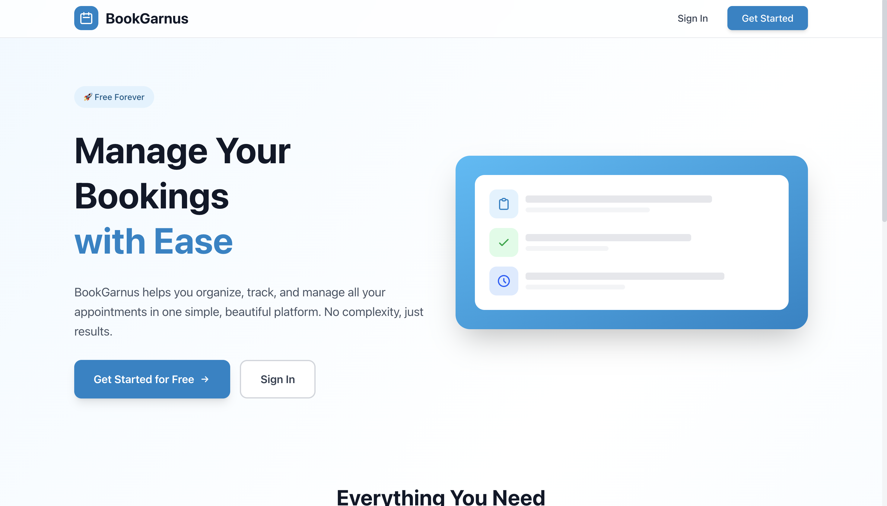
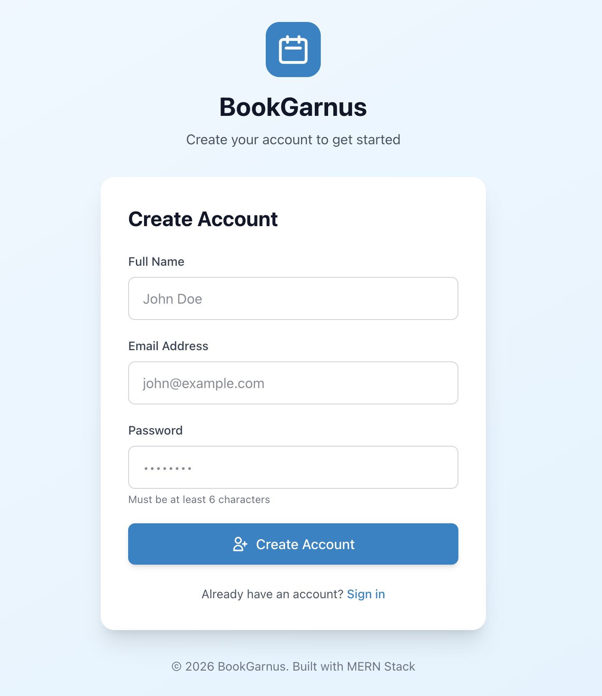
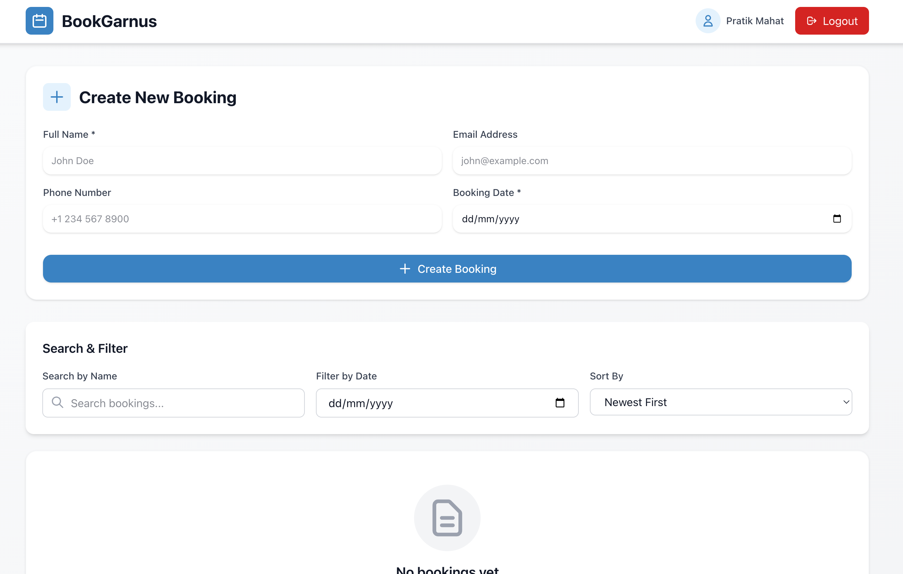
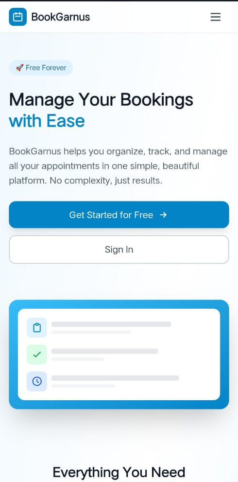

# 🗓️ BookGarnus - Modern Booking Management System

**BookGarnus** (Book + Garnus = "Let's Book" in Nepali) - A full-stack MERN application for managing appointments and bookings with authentication, search, and modern UI.



---

## 🚀 Live Demo

**🌐 Live Application:** [https://bookgarnus.vercel.app](https://bookgarnus.vercel.app)

**🔗 Backend API:** [https://bookgarnus-api.onrender.com](https://bookgarnus-api.onrender.com)

**📝 Test Credentials:**
- Email: demo@bookgarnus.com
- Password: demo123

*(Or create your own account)*

---

## ✨ Features

### User Features
- 🔐 **Secure Authentication** - JWT-based registration and login
- ➕ **Create Bookings** - Easy booking creation with form validation
- 📋 **View Bookings** - See all your appointments in one place
- ✏️ **Edit Bookings** - Update booking details anytime
- 🗑️ **Delete Bookings** - Remove bookings with confirmation
- 🔍 **Search** - Find bookings by name instantly
- 📅 **Filter by Date** - View bookings for specific dates
- 🔄 **Sort Options** - Newest, Oldest, or Alphabetically
- 📱 **Mobile Responsive** - Works perfectly on all devices

### Technical Features
- 🔒 **Protected Routes** - Dashboard accessible only to authenticated users
- 🎨 **Modern UI** - Beautiful Tailwind CSS design
- ⚡ **Fast Performance** - Optimized React components
- 🌐 **RESTful API** - Clean backend architecture
- 💾 **MongoDB Atlas** - Cloud database with data persistence
- 🚀 **Production Deployed** - Live on Vercel and Render

---

## 🛠️ Tech Stack

### Frontend
- **React 18** - Modern UI library
- **Vite** - Lightning-fast build tool
- **Tailwind CSS** - Utility-first CSS framework
- **React Router** - Client-side routing
- **Context API** - State management

### Backend
- **Node.js** - JavaScript runtime
- **Express.js** - Web framework
- **MongoDB & Mongoose** - Database and ODM
- **JWT** - Authentication tokens
- **bcryptjs** - Password hashing

### Deployment
- **Vercel** - Frontend hosting
- **Render** - Backend hosting
- **MongoDB Atlas** - Database hosting

---

## 📸 Screenshots

### Landing Page


### Authentication


### Dashboard


### Booking


### Mobile View


---

## 🚀 Quick Start

### Prerequisites
- Node.js v18+
- MongoDB Atlas account
- npm or yarn

### Installation

#### 1. Clone the repository
```bash
git clone https://github.com/YOUR_USERNAME/bookgarnus.git
cd bookgarnus
```

#### 2. Setup Backend
```bash
cd booking-system-backend
npm install

# Create .env.development
PORT=8080
MONGO_URI=your_mongodb_uri
NODE_ENV=development
JWT_SECRET=your_jwt_secret
JWT_EXPIRES_IN=7d

npm run dev
```

#### 3. Setup Frontend
```bash
cd booking-system-frontend
npm install

# Create .env
VITE_API_URL=http://localhost:8080

npm run dev
```

#### 4. Open browser
- Frontend: http://localhost:5173
- Backend: http://localhost:8080

---

## 📁 Project Structure
```
bookgarnus/
├── booking-system-frontend/
│   ├── src/
│   │   ├── components/
│   │   │   ├── LandingPage.jsx
│   │   │   ├── Login.jsx
│   │   │   ├── Register.jsx
│   │   │   ├── Dashboard.jsx
│   │   │   ├── BookingForm.jsx
│   │   │   ├── BookingList.jsx
│   │   │   ├── SearchFilter.jsx
│   │   │   └── ...
│   │   ├── context/
│   │   │   └── AuthContext.jsx
│   │   ├── services/
│   │   │   └── api.js
│   │   └── App.jsx
│   └── package.json
│
├── booking-system-backend/
│   ├── config/
│   │   └── env.js
│   ├── database/
│   │   └── mongodb.js
│   ├── models/
│   │   ├── User.model.js
│   │   └── bookings.model.js
│   ├── controllers/
│   │   ├── authController.js
│   │   └── bookingController.js
│   ├── routes/
│   │   ├── authRoutes.js
│   │   └── bookingRoutes.js
│   ├── middleware/
│   │   ├── auth.js
│   │   └── errorMiddleware.js
│   └── server.js
│
└── README.md
```

---

## 🔧 API Endpoints

### Authentication
- `POST /api/v1/auth/register` - Register new user
- `POST /api/v1/auth/login` - Login user

### Bookings (Protected)
- `GET /api/v1/bookings` - Get all user bookings
- `POST /api/v1/bookings` - Create new booking
- `GET /api/v1/bookings/:id` - Get single booking
- `PUT /api/v1/bookings/:id/edit` - Update booking
- `DELETE /api/v1/bookings/:id` - Delete booking

*All booking routes require `Authorization: Bearer <token>` header*

---

## 🎯 Key Learnings

### What I Built
- Full-stack application from scratch
- JWT authentication system
- RESTful API with proper MVC architecture
- React Context for state management
- Protected routes and user-specific data
- Search and filter functionality
- Responsive UI with Tailwind CSS

### Challenges Solved
- Implementing secure authentication
- Managing user-specific data isolation
- Handling CORS in production
- Deploying to multiple platforms
- Environment variable management

---

## 🌟 Future Enhancements

- [ ] Email notifications for bookings
- [ ] Calendar view for bookings
- [ ] Booking reminders
- [ ] Export bookings to CSV/PDF
- [ ] Dark mode
- [ ] Booking categories/tags
- [ ] Admin dashboard
- [ ] Analytics and reports

---

## 👨‍💻 Developer

**Your Name**  
Nepal-based Full Stack Developer

- 🌐 Portfolio: [https://sudipkhatiwada.vercel.app/]
- 💼 LinkedIn: [https://www.linkedin.com/in/sudipkhatiwada/]
- 📧 Email: ksudip121@gmail.com

---

## 📝 License

MIT License - feel free to use this project for learning!

---

## 🙏 Acknowledgments

- Built as a portfolio project demonstrating full-stack development skills
- Inspired by the need for simple, effective booking management solutions
- Special thanks to the MERN stack community


