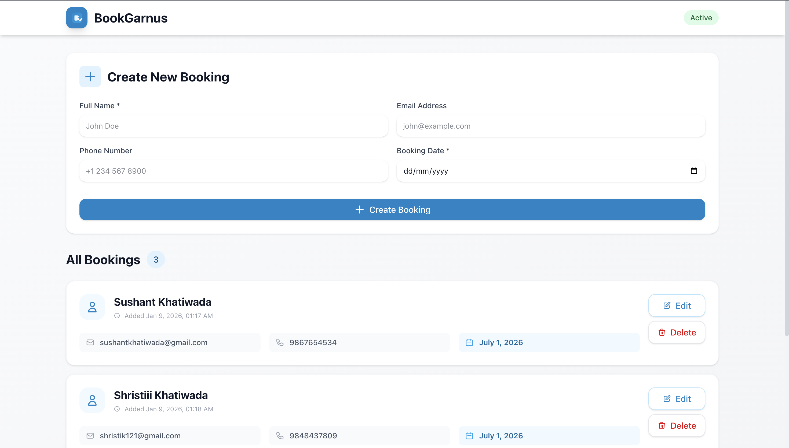

# 🗓️ BookGarnus - Booking Management System

**BookGarnus** (Book + Garnus = "Let's Book" in Nepali) - A full-stack MERN application for managing appointments and bookings. Built by a Nepal-based developer with modern web technologies.



## 🚀 Features

### Current
- ✅ Full CRUD operations for bookings
- ✅ Modern, responsive UI with Tailwind CSS
- ✅ RESTful API architecture
- ✅ MongoDB Atlas integration
- ✅ Clean component structure
- ✅ Error handling
- ✅ Professional folder structure with separation of concerns

### Coming Soon
- 🔄 Search and filter bookings
- 🔄 Form validation with error messages
- 🔄 Toast notifications
- 🔄 User authentication (JWT)
- 🔄 Protected routes
- 🔄 Email notifications
- 🔄 Deployment (Vercel + Render)

## 🛠️ Tech Stack

**Frontend:**
- React 18
- Vite
- Tailwind CSS
- Fetch API

**Backend:**
- Node.js
- Express.js
- MongoDB & Mongoose
- ES6 Modules
- dotenv for environment management

## 📦 Project Structure

```
bookgarnus/
├── booking-system-frontend/    # React frontend
│   ├── src/
│   │   ├── components/         # Reusable UI components
│   │   │   ├── Layout.jsx
│   │   │   ├── BookingForm.jsx
│   │   │   ├── BookingList.jsx
│   │   │   └── BookingItem.jsx
│   │   ├── services/           # API service layer
│   │   │   └── api.js
│   │   ├── App.jsx             # Main application
│   │   └── main.jsx            # Entry point
│   ├── tailwind.config.js      # Tailwind configuration
│   └── package.json
│
├── booking-system-backend/     # Express backend
│   ├── config/                 # Configuration files
│   │   └── env.js
│   ├── database/               # Database connection
│   │   └── mongodb.js
│   ├── models/                 # Mongoose schemas
│   │   └── bookings.model.js
│   ├── controllers/            # Business logic
│   │   └── bookingController.js
│   ├── routes/                 # API routes
│   │   └── bookingRoutes.js
│   ├── server.js               # Entry point
│   └── package.json
│
└── README.md
```

## 🚀 Quick Start

### Prerequisites
- Node.js (v18+)
- MongoDB Atlas account
- npm or yarn

### Installation

1. **Clone the repository**
   ```bash
   git clone https://github.com/YOUR_USERNAME/bookgarnus.git
   cd bookgarnus
   ```

2. **Setup Backend**
   ```bash
   cd booking-system-backend
   npm install
   
   # Create .env.development file
   # Add your MongoDB URI and configuration
   PORT=8080
   SERVER_URL=http://localhost:8080
   NODE_ENV=development
   MONGO_URI=your_mongodb_atlas_uri
   
   npm run dev
   ```

3. **Setup Frontend** (in new terminal)
   ```bash
   cd booking-system-frontend
   npm install
   npm run dev
   ```

4. **Open browser**
   - Frontend: http://localhost:5173
   - Backend: http://localhost:8080

## 📸 Screenshots

> Screenshots will be added after deployment

## 🎯 API Endpoints

### Bookings
- `GET /api/bookings` - Get all bookings
- `GET /api/bookings/:id` - Get single booking by ID
- `POST /api/bookings` - Create new booking
- `PUT /api/bookings/:id` - Update existing booking
- `DELETE /api/bookings/:id` - Delete booking

### Request/Response Format

**Create Booking (POST /api/bookings):**
```json
{
  "name": "John Doe",
  "email": "john@example.com",
  "phone": "1234567890",
  "date": "2026-01-15"
}
```

**Response:**
```json
{
  "success": true,
  "message": "Booking created successfully",
  "data": {
    "_id": "...",
    "name": "John Doe",
    "email": "john@example.com",
    "phone": "1234567890",
    "date": "2026-01-15",
    "createdAt": "2026-01-09T...",
    "updatedAt": "2026-01-09T..."
  }
}
```

## 🏗️ Architecture Highlights

- **MVC Pattern**: Clean separation of Models, Controllers, and Routes
- **API Service Layer**: Centralized API calls in frontend
- **Component-Based UI**: Reusable React components
- **Environment-Based Config**: Separate development and production settings
- **Error Handling**: Comprehensive error handling on both frontend and backend
- **Modern ES6+**: Using ES6 modules, async/await, arrow functions

## 🎯 Roadmap

- [x] Basic CRUD operations
- [x] Modern UI with Tailwind CSS
- [x] MongoDB Atlas integration
- [x] Professional folder structure
- [x] RESTful API design
- [ ] Search & Filter functionality
- [ ] Frontend form validation
- [ ] Toast notifications
- [ ] User authentication (JWT)
- [ ] Protected routes
- [ ] Deployment (Vercel + Render)
- [ ] Email notifications
- [ ] Analytics dashboard

## 🌟 Why BookGarnus?

**BookGarnus** combines "Book" (English) with "Garnus" (गर्नुहोस् - "Let's do it" in Nepali), representing the ease and enthusiasm of booking appointments. Built with the efficiency of modern web technologies and the spirit of Nepali innovation.

## 👨‍💻 Developer

**Sudip Khatiwada**  
Nepal-based Full Stack Developer specializing in MERN Stack  
- Portfolio:  https://sudipkhatiwada.vercel.app/
- LinkedIn: https://www.linkedin.com/in/sudipkhatiwada/
- Email: ksudip121@gmail.com

## 🤝 Contributing

Contributions, issues, and feature requests are welcome!

## 📝 License

MIT License - feel free to use this project for learning!

## 🙏 Acknowledgments

- Built as part of learning full-stack web development
- Inspired by the need for simple, efficient booking management solutions
- Thanks to the MERN stack community

---

**BookGarnus** -  book गर्नुहोस्,  organizeग र्नुहोस्, succeed गर्नुहोस्! 🗓️✨

---
